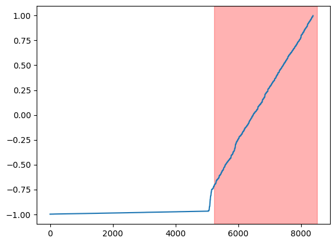

# [Detecting Spacecraft Anomalies Using LSTMs and Nonparametric Dynamic Thresholding](https://arxiv.org/pdf/1802.04431.pdf)

## Authors: [Kacper Majchrzak, Norbert Klockiewicz, Patryk Kożuch]

### 1. Introduction

Our project focuses on identifying potential anomalies in telemetry data from the SMAP satellite and the Curiosity Mars rover. In this project, we use Long Short-Term Memory (LSTM) recurrent neural networks to forecast future telemetry data. Then, we apply a non-parametric dynamic thresholding method to compare the forecasted data with the actual telemetry data. As a result, we determine a local threshold, exceeding which is interpreted as a potential anomaly. Our method enables the detection and analysis of irregularities in the data.

### 2. Data Analysis

The data is organized into readings from various indicators. These readings consist of several channels, with the first channel containing information related to telemetry data, while the remaining channels contain command data recorded in binary form. For security reasons, precise information about the content of the remaining channels is not available.

### 3. Model

We use a separate model for each component to predict telemetry data. The reason for this approach is that using a single model to predict data for each component would require a very complex model architecture. We aim for the predicted data to be as generalized as possible, which helps in detecting anomalies in real data later on. Therefore, we chose this path. For each component, the model architecture is the same and is presented in the table below:

```
Model: "sequential"
_________________________________________________________________
 Layer (type)                Output Shape              Param #
=================================================================
 lstm (LSTM)                 (None, None, 80)          33920

 dropout (Dropout)           (None, None, 80)          0

 lstm_1 (LSTM)               (None, 80)                51520

 dropout_1 (Dropout)         (None, 80)                0

 dense (Dense)               (None, 10)                810

 activation (Activation)     (None, 10)                0

=================================================================
Total params: 86,250
Trainable params: 86,250
Non-trainable params: 0
_________________________________________________________________
```

### 4. Nonparametric Dynamic Threshold - Anomaly Detection

Our data is divided into sequences, each of which is analyzed for the presence of anomalies. Then, for the parameter **z** in the range of 2 to 10, epsilon is calculated. We identify values below epsilon as well as those above, which are potential anomalies. Values above epsilon are combined into continuous sequences. Then, we calculate a score that allows for adjusting epsilon. The formula for the score is illustrated in the [reference](https://arxiv.org/pdf/1802.04431.pdf) and detailed in the cited article.

### 5. Model Validation

Model validation was performed by comparing the original plots along with human-detected anomalies to the plots generated by our model and the anomalies found by the **Nonparametric Dynamic Threshold**.

#### Sample Results:

---

|     | Oryginalne                            | Wykryte                            |
| --- | ------------------------------------- | ---------------------------------- |
| D3  |    |    |
| D9  |    |    |
| E12 |  |  |

### 6. Summary

We achieved satisfactory results. The detected anomalies are not perfectly indicated but are capable of automating the process of their detection.
