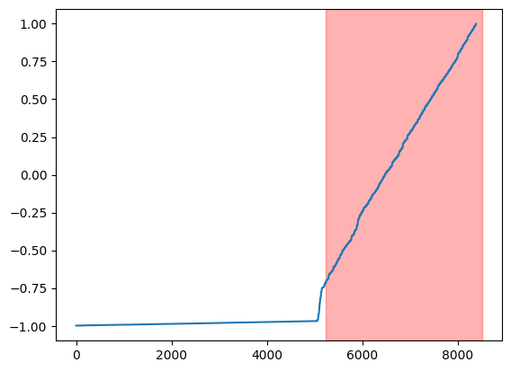
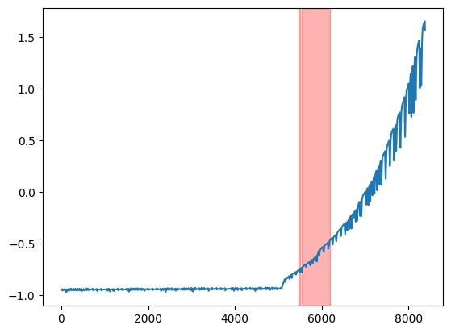
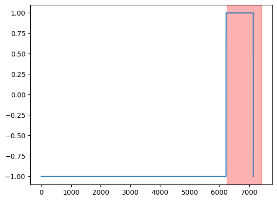
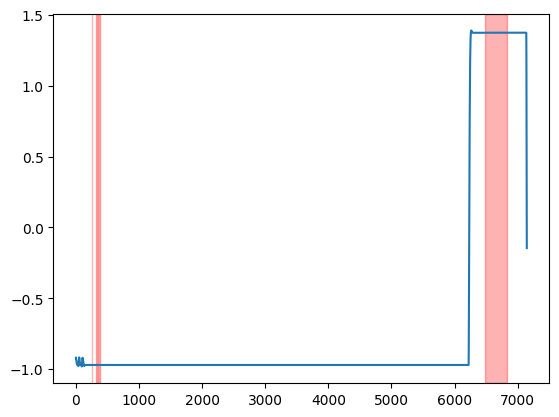
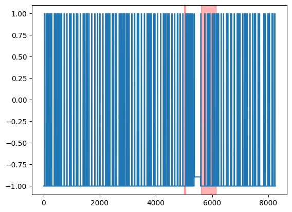
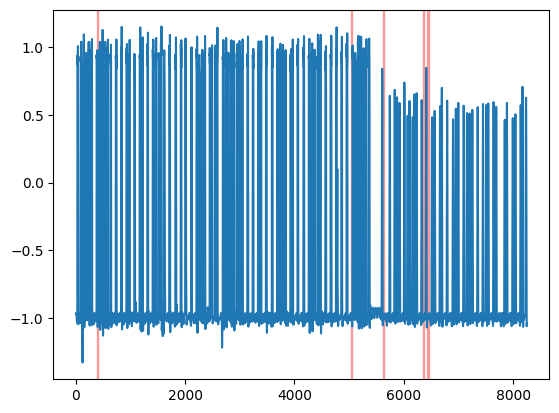

# [Detecting Spacecraft Anomalies Using LSTMs and Nonparametric Dynamic Thresholding](https://arxiv.org/pdf/1802.04431.pdf)
## Authors: [Kacper Majchrzak, Norbert Klockiewicz, Patryk Kożuch]

### 1. Wstęp
Nasz projekt skupia się na identyfikacji potencjalnych anomalii w danych telemetrycznych pochodzących z satelity SMAP oraz łazika marsjańskiego Curiosity. W ramach tego projektu wykorzystujemy rekurencyjne sieci neuronowe typu LSTM do prognozowania przyszłych danych telemetrycznych. Następnie, stosujemy metodę nieparametrycznego progowania dynamicznego w celu porównania prognozowanych danych z rzeczywistymi danymi telemetrycznymi. W rezultacie wyznaczamy lokalny próg, którego przekroczenie jest interpretowane jako potencjalna anomalia. Nasza metoda umożliwia wykrycie i analizę nieprawidłowości w danych.

### 2. Analiza danych
Dane są uporządkowane w ramach odczytów pochodzących z różnorodnych wskaźników. Te odczyty składają się z kilkunastu kanałów, z których pierwszy kanał zawiera informacje dotyczące danych telemetrycznych, podczas gdy pozostałe kanały zawierają dane komend zapisane w formie binarnej. Ze względów bezpieczeństwa brakuje precyzyjnych informacji odnośnie zawartości pozostałych kanałów.

### 3. Model
Do przewidywania danych telemetrycznych używamy osobnego modelu dla każdego komponentu. Powodem, dla którego zdecydowaliśmy się na taki ruch jest fakt, że do przewidywania danych dla każdego komponentu jednym modelem, architektura takiego modelu musiałaby być bardzo złożone. Nam natiomast zależy na tym aby przewidywane dane były jak najbardziej uogólnione, pomaga to w późniejszym wykryciu anomalii w prawdziwych danych. Zdecydowaliśmy się więc obrać taką ścieżkę. Dla każdego komponentu architektura modelu jest taka sama i wygląda tak jak ta przedstawiona w tabelii:
```
Model: "sequential"
_________________________________________________________________
 Layer (type)                Output Shape              Param #   
=================================================================
 lstm (LSTM)                 (None, None, 80)          33920     
                                                                 
 dropout (Dropout)           (None, None, 80)          0         
                                                                 
 lstm_1 (LSTM)               (None, 80)                51520     
                                                                 
 dropout_1 (Dropout)         (None, 80)                0         
                                                                 
 dense (Dense)               (None, 10)                810       
                                                                 
 activation (Activation)     (None, 10)                0         
                                                                 
=================================================================
Total params: 86,250
Trainable params: 86,250
Non-trainable params: 0
_________________________________________________________________
```

### 4. Nonparametric Dynamic Threshold - wykrywanie anomalii
Nasze dane są podzielone na sekwencje, z których każda jest analizowana pod kątem obecności anomalii. Następnie dla parametru **z** z zakresu od 2 do 10 obliczany jest epsilon. Wyznaczamy wartości poniżej epsilonu oraz powyżej, które są potencjalnymi anomaliami. Wartości powyżej epsilonu są łączone w ciągłe sekwencje. Następnie obliczamy wskaźnik (score), który umożliwia dostosowanie epsilonu. Formuła wskaźnika jest zobrazowana w [referencji](https://arxiv.org/pdf/1802.04431.pdf) i szczegółowo opisana w cytowanym artykule.

### 5. Walidacja Modelu
Walidacja modelu odbyła się poprzez porównanie wykresów oryginalnych wraz z anomaliami wykrytymi przez ludzi z wykresami wygenerowanymi przez nasz model oraz anomaliami znalezionymi przez **Nonparametric Dynamic Threshold**.
#### Przykładowe wyniki:
---
|   |Oryginalne|Wykryte|
|---|---|---|
|D3|||
|D9|||
|E12|||

### 6. Podział prac
- Kacper Majchrzak - dynamiczne wyznaczanie błędów
- Patryk Kozuch - research oraz przygotowanie danych z artykułu
- Norbert Klockiewicz - stworzenie oraz trenowanie modelu

Powyższy podział poakzuje osoby głównie odpowiedzalne za dany segment, jednak każda osoba brała czynny udział w każdym z powyższych segmentów.

### 7. Podsumowanie
Udało się uzyskać zadowalające rezultaty. Wykryte anomalie nie są idealnie wskazane jednak są w stanie zautomatyzować proces ich wyszukiwania.
